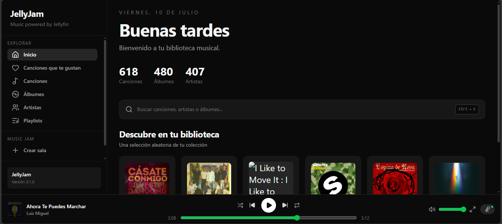
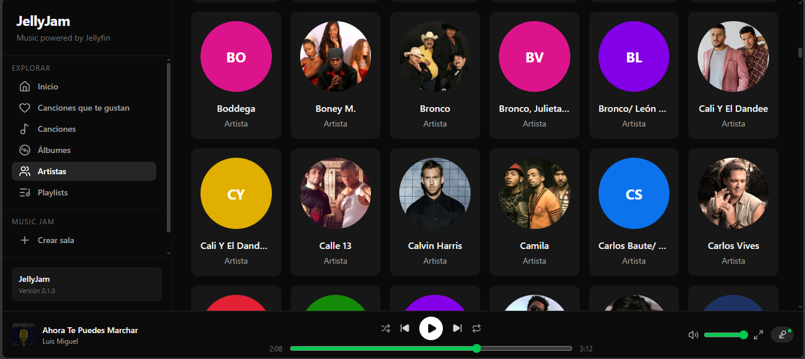
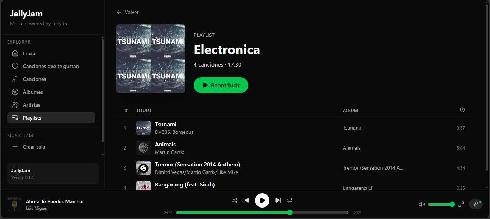
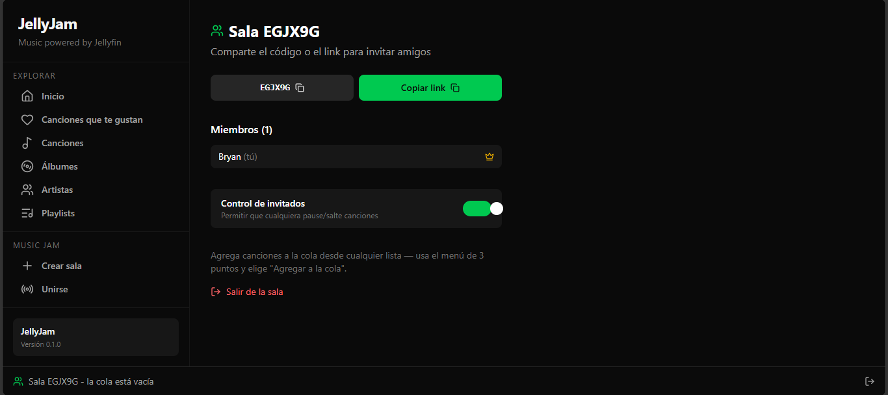
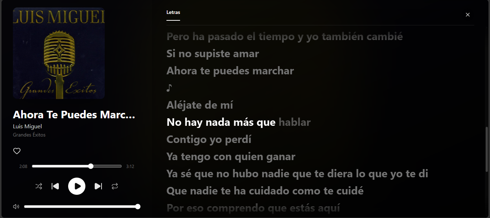

<h1 align="center">🎵 JellyJam</h1>

  <b>A Spotify-like web client for Jellyfin, with real-time synchronized listening rooms.</b>

  
  

---

## 📌 About the Project

**JellyJam** is an open-source web music client built on top of **Jellyfin** media servers. It brings a modern, Spotify-style interface to your self-hosted music library — full library browsing, a gapless player, favorites, playlists, and its flagship feature: **Music Jam**, a synchronized multi-user listening room where you and your friends can stream the same music, perfectly in sync, from your own server.

There's no separate account system — authentication is handled entirely through your existing Jellyfin credentials, so there's nothing extra to manage.

> ⚠️ **Note:** JellyJam is under active development. The core experience described below is functional and has been tested end-to-end (including on mobile browsers), but the UI and feature set are still evolving.

---

## ✨ Features

### Library & Playback
- Full library browser — Songs, Albums, Artists, and Playlists, with search
- Local player with Fisher–Yates shuffle, three repeat modes, volume/mute, and dual-slot A/B gapless preloading for seamless track transitions
- Full-screen player view with synced lyrics, powered by **[LRCLIB](https://lrclib.net/)** (see credits below)
- Favorites, bidirectionally synced with Jellyfin's own `IsFavorite` field
- Full playlist management (create, add tracks, remove tracks) via Jellyfin's Playlist API
- Server-side audio transcoding with caching, so each track is only ever transcoded once

### Music Jam 🎧
- Create a room and get a 6-character join code or a shareable invite link
- Host/guest permission model, with an optional toggle to let guests control playback
- Open queue — anyone in the room can add tracks
- Server-authoritative playback state with NTP-style clock synchronization, so everyone hears the same thing at the same time, regardless of network latency
- Member list with host transfer and kick support

### Auth
- JWT session issued by the backend, but authentication itself is delegated entirely to Jellyfin — no separate password storage

---

## 🖼️ Screenshots

   
  <i>Home</i>

   
  <i>Artists</i>

   
  <i>Playlists</i>

   
  <i>Music Jam — synchronized listening room</i>

   
  <i>Full-screen player with synced lyrics</i>

---

## 🛠️ Tech Stack

The project is a decoupled full-stack application:

* **Frontend:** React + TypeScript + Vite + Tailwind CSS, with TanStack Query for server state and Zustand for client state.
* **Backend:** Node.js + Express + Socket.IO for real-time room synchronization, PostgreSQL for persistent app data, and in-memory state for active room sessions.
* **Infrastructure:** Deployed across two Azure VMs — one dedicated to Jellyfin, one to the backend — behind Nginx, which handles static serving and WebSocket upgrades.

Express was chosen over NestJS for v1 to keep iteration fast while the Music Jam protocol was still unstable; a move to NestJS may be revisited later.

---

## 🎤 Lyrics Credits

Synced lyrics in the full-screen player are provided by **[LRCLIB](https://lrclib.net/)**, a free and open lyrics database. Huge thanks to the LRCLIB project and its contributors for making this possible.

---

## 🚀 Roadmap

- [x] Jellyfin authentication and server connection
- [x] Full library browsing (songs, albums, artists, playlists)
- [x] Local player with gapless playback and synced lyrics
- [x] Favorites and playlist management
- [x] Music Jam: synchronized real-time listening rooms
- [x] Host/guest permissions, queue management, invite links
- [ ] Redis-backed room state for horizontal scaling
- [ ] Mobile app / PWA polish
- [ ] UI refinements and theming

---

## 🤝 Contributing

Since this is an open-source initiative, contributions, ideas, and feedback are highly welcome! Feel free to open an issue or reach out if you want to discuss the roadmap.
